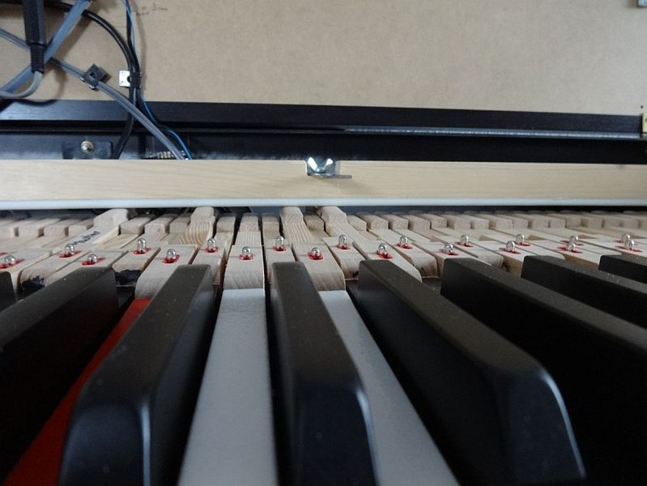

## Tasteninstrument mit 6+6 Tastatur

Dieses Archiv enthält Anleitungen, Dokumentation und Quellcode zum Bau eines MIDI Instruments mit 6+6 Tastatur. 

Die Tastatur entspricht im vorderen Bereich der eines mechanischen Klaviers. Im hinteren Bereich kommen anstatt der Hammermechanik Bleigewichte und eine Stoppleiste zum Einsatz. Der [Bau der Tastatur ist hier](mechanics/README.md) beschrieben.

Die Elektronik basiert auf einem handelsüblichen Stummschaltesystem für Klaviere (QuietTime), das bereits Klangerzeugung enthält und MIDI-Signale ausgeben kann. Das ist für reines Klavierspiel vollkommen ausreichend. 

Ein Arduino Mega 2560 erweitert das Instrument um zusätzliche Regler, die Möglichkeit Presets für Sound Module abspeichern sowie ein Basspedal mit Diodenmatrix anschließen zu können. Die [Hardware ist hier](electronics/README.md) und die [Software und deren Bedienung hier](software/README.md) beschrieben.
