# 6+6 Tastatur

## Ausgangslage

Eine FATAR-Tastatur mit Döpfer LMK3-Elektronik in einem Roland Digitalpiano-Oberteil, [selbst umgerüstet](https://github.com/HaraldRieder/Historic/index.html) von 7+5 auf 6+6. Im Vergleich zu einem mechanischen Klavier ist das Spielgefühl darauf deutlich unpräziser. Ich wollte etwas Besseres haben.

(Achtung: der MIDI File Printer hinter dem Link oben ist veraltet, der aktuellste liegt auf [GitHub](https://github.com/HaraldRieder/MIDIprt).)

## Kaufversuche

Sehr hilfsbereit war Dr. Pfeiffer, Geschäftsführer der gleichnamigen Flügel- und Klavierfabrik in Leonberg bei Stuttgart; nur leider nicht Tastaturfabrik: die Firma Pfeiffer kauft ihre Tastaturen fertig ein. Dr. Pfeiffer schlug vor, eine Tastatur spezialanfertigen zu lassen und darauf eine Flügelmechanik zu setzen. Das wäre schon das Non-Plus-Ultra in Sachen Spielgefühl geworden, doch angesichts von 3000 € Kosten allein für die Flügelmechanik sowie deren Ausmaßen habe ich diese Möglichkeit verworfen. Auch die Vorstoße bei den Tastaturlieferanten schienen preislich in diese Richtung zu zeigen (nur für die Tastatur), wobei nicht klar war, was man sonst noch für Kompromisse hätte eingehen müssen.

Eine Anfrage bei Schimmel, wo [Johannes Beyreuther](http://www.beyreuther-musikprinzip.de/) einst sein 6+6 Klavier spezialanfertigen lassen hatte, versandete trotz Nachhakens. Dr. Pfeiffer hatte gemeint, wenn schon eine Zeichnung existierte, dann wäre der Aufwand für so eine Spezialanfertigung wesentlich geringer.

Dann lernte ich, dass Klaviertasten Knicke haben, weil die Hammermechanik breiter als die Tastatur ist: je länger die Taste, desto weniger Verkantungsgefahr. Ich wollte eigentlich keine Mechanik. Und ich wollte keine unnötigen Knicke.

Schließlich kam ich zur Entscheidung, selbst eine Klaviatur zu bauen.

## Selbstbau
### Studium

Dazu musste ich erst einmal lernen, wie man eine richtige Klaviertastatur baut. Ich ging in die Stuttgarter Stadtbibliothek und lieh mir alle brauchbaren Bücher zum Thema aus (3 Stück). Danach wusste ich, welche Teile und Werkzeuge ich brauchen würde.

### Vorrecherche

Als Nächstes musste herausgefunden werden, ob die benötigten Teile überhaupt für Endverbraucher zu kaufen sind. Das sind sie, z.B. online bei [Meyne](https://shop.meyne.com/) oder bei [FTP](http://ftppianoforti.com/it/index). FTP schien insgesamt etwas preisgünstiger zu sein. Aber die Teile würden irgendwo zwischen 200 € und 300 € kosten, wobei ich mir die Klaviaturdruckzange erst mal verkneiffen musste, vielleicht würde es ja ohne gehen. Sie kostet allein mindestens 90 €, je nach Modell. Dazu käme natürlich das Holz, aber das gäbe es aus dem Baumarkt zu einem vernachlässigbaren Preis. An normalem - d.h. nicht Klavierbauspezial - Werkzeug fehlte mir: ein Bohrmaschinenständer mit Maschinenschraubstock, ein Fräskopf (für die Garnierungsvertiefung) und vielleicht noch ein paar Kleinigkeiten wie Holzbohrer in genau den richtigen Durchmessern für die Waagebalkenstifte oder die Tastaturvorderstifte.

Die schwarzen Obertastenbeläge waren freilich auch zu kaufen. Nur bräuchte ich 2 Sätze à 36 Stück, da eine 6+6 Klaviatur mehr schwarze Tasten als eine 7+5 Tastatur hat. Doch woher sollte ich die weißen Tastenbeläge nehmen? Die gab es nur oktavweise zu kaufen, davon hätte ich höchstens die D-Taste brauchen können. Ich hätte 44 Oktaven für 44 D-Tasten kaufen müssen! Viel zu teuer!! Die andere Alternaive wäre gewesen, die Beläge selbst zu sägen. Dazu wären eine Bandsäge und eine Poliermaschine notwendig geworden. Das klang nach viel Arbeit mit zweifelhaftem Resultat.

Aber vielleicht ginge es auch per 3D-Druck? Ja, es ginge! Ein grobes erstes Modell war mit Hilfe von [Tinkercad](https://www.tinkercad.com/) schnell erstellt. Dieses hochgeladen zu [Trinckle](http://www.trinckle.com/) lieferte gleich den zu erwartenden Preis: bei entsprechender Stückzahl je Druckvorgang um die 6 € je Tastenober- + Vorderbelag, also je Untertaste. Mit Infiltrierung würden die Tastenbeläge abriebfest sein. Dafür könnte ich selbst mit Epoxydharz sorgen. Epoxydharz gibt es z.B. bei Conrad.

Dann fehlten mir nur noch die Töne. Ein stummes Instrument mit schöner Tastatur wäre nicht wirklich genial. Da das Instrument transportabel bleiben sollte, kam nur Elektronik in Frage. Die Lösung wäre ein QuietTime GT-2 mini von [PianoDisk](http://www.pianodisc.eu/) hauptsächlich in der Funktion als Tonabnehmer. Wie ich inzwischen weiß, sind die Sounds: naja. Der mitgelieferte Kopfhörer gibt ihnen vollends den Rest! Der Roland JV-1010 wird also weiterhin als Klangerzeuger zum Einsatz kommen (und das wunderbare Cembalo aus dessen Super Sound Set). Das GT-2 mini würde das teuerste Teil des Projekts: 1300 € mit DIN MIDI-Adapter. Ich bestellte es bei Hr. Hermann, Inhaber des gleichnamigen Klavier- und Flügelhandels, in Möglingen. Er lieferte mir auch fertig garnierte Klaviaturbäckchen. Diese komplett selbst zu bauen schien mir doch zu kitzlig. Bei FTP könnte man sie aber auch kaufen. Hr. Hermann gab mir außerdem ein paar ausrangierte schwarze und weiße Tasten mit, damit ich diese genauer studieren konnte.

Alles in allem würde die Tastatur auf knapp 2000 € kommen. Bei einer Nutzungsdauer bis zu meinem Lebensende ein vertretbarer Preis.

### Planung

Die Planung startete mit dem Ausmessen der Tasten meines Juno-D, LMK3 sowie denen des Klaviers meiner Tochter. Höhe des Tastenholzes würde 20 mm sein, das ist bei einem Tastenhub von 10 mm vorne auch das absolute Minimum. Schließlich muss der Klaviaturvorderstift in der Taste verschwinden können. Vorteil der 20 mm: dieses Maß bekommt man im Baumarkt. Die Länge ergab sich aus dem zur Verfügung stehenden Platz im Digitalpianogehäuse: 349 mm bzw. 299 mm. Bzw. genau 350 mm inkl. 1 mm Vorderbelag. Die Breiten entsprechen denen eines Standardklaviers. Die Untertasten sind vorne ca. 7/6 mal breiter als die bei einer 7+5 Tastatur. Bei Hornbach gab es Fichtenleisten mit Querschnitt 13,5 x 20 mm (für die Untertasten) und 10 x 20 mm (für die Obertasten).

*Festlegung der Höhen*

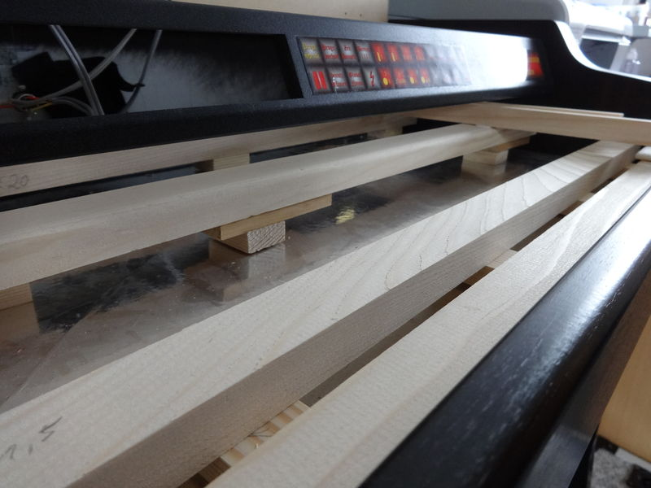

Sehr pfriemelig war es, die Höhen des Waagebalkens, des Ruhebalkens hinten und der vorderen Balken festzulegen. Schließlich war das Gehäuse mit all seinen Maßen vorgegeben. Außerdem sollten die handelsüblichen Holzmaße verwendet werden können. Zu berücksichtigen sind die Höhen des hinteren Tastaturfilzes, der vorderen Druckscheiben sowie der Waagebalkenscheiben. Der Tastenhub soll exakt 10 mm betragen. Wenn man für den Waagebaalken statt 1,0 mm Kasimirscheiben solche mit 1,2 mm nimmt, bedeutet das einen Hubunterschied von 2 * (1,2 - 1,0) = 0,4 mm. Und das kann sich bereits bemerkbar machen! Die Filze für vorne und hinten gibt es ab ca. 4 mm aufwärts in 1 mm Abstufungen. Ich entschied mich für jeweils 5 mm Dicke. Mal sehen, ob alles passen wird...

*Festlegung der Höhen*

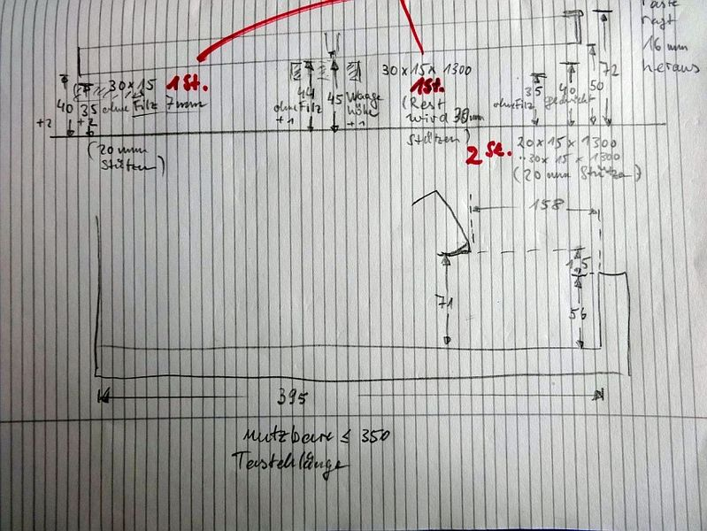

Nach momentanem Plan sollen die 50 g Niederdruckgewicht vorne allein durch Bleigewichte hinten an den Tasten erreicht werden. Ob damit ein vernünftiges Spielgefühl erreicht werden kann, wird sich zeigen. Da die Mechanik fehlt, ist viel Blei notwendig (ca. 5 kg, ca. 50 g je Taste). Unklar ist, ob der Schwung der 50 g Blei hinten zu einem inakzeptablen Verschleiß des Waagebalkenlochs führen wird. Man könnte es mit Holzleim verstärken oder Gummi verwenden. Man könnte auch über den Tasten den Schwung mit Gummipuffern auffangen und reflektieren, was zu besserer Repetition führen könnte. Eine andere Alternative wäre es, weniger Gewicht und statt dessen zusätzliche Federn zu verwenden. Ich werde mal nur mit Bleigewichten in's Rennen gehen, alles Weitere wird sich zeigen...

*Bleigewichtung und Waagebalkenlöcher*

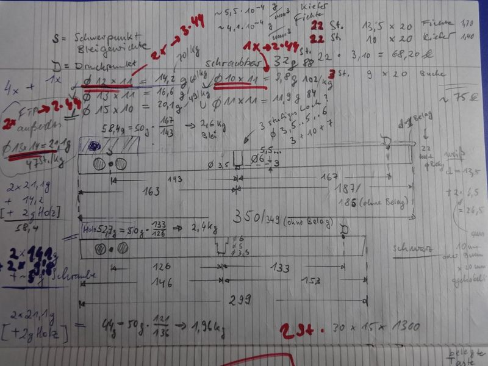

Das Ausrechnen der Bleigewichte für die Bestellung war auch knifflig. Blei kann man nur kiloweise kaufen. Aus der Dichte von Blei und den Maßen der Bleistöpsel kommt man auf die Anzahl der Stöpsel, die in 1 kg enthalten sein müssten - jedenfalls nach meiner Berechnung. Manche Stöpselgewichte sind ungeeignet. Nicht wegen ihres Einzelgewichtes. Das würde man vielleicht gut einsetzen können. Aber was will mit mit 1 kg in Form von 80 Stöpseln, wenn man 88 (oder 44) Tasten damit ausstatten soll? Entweder hat man 8 Stöpsel zu wenig oder 36 zu viel. Und nur kleine Stöpsel will man auch nicht kaufen, denn dann müsste man sehr viele Löcher bohren. Manche großen Stöpsel, obwohl sie vielleicht das passende Gewicht hätten, lassen sich wiederum nicht für die Obertasten verwenden, da deren Holz nur 10 mm breit ist und die Stöpsel links und rechts zu weit aus der Taste herausstehen würden (bis zum Stöpsel der Nachbartaste). Das Thema Blei ist also abenteuerlich...

### Tasten sägen und fräsen
Die Tasten sägte ich alle von Hand. Die übliche Abschrägung an einer Seite der Obertasten gelang durch schräges Einspannen.

*Auseinandersägen der Obertasten*

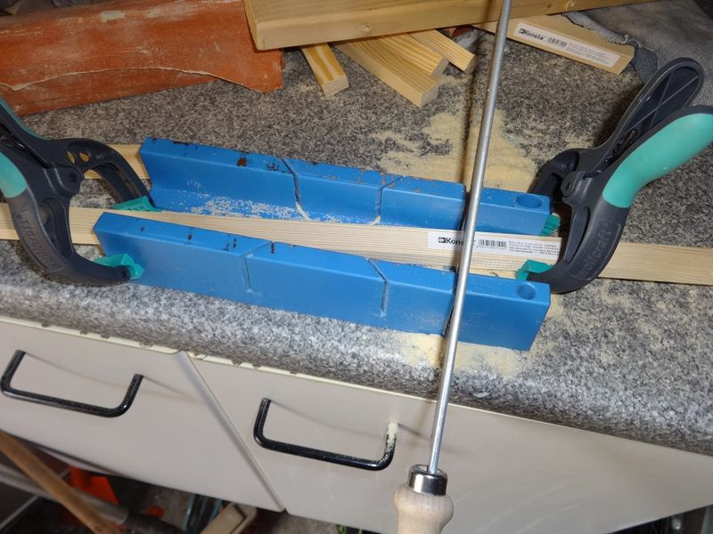

Normalerweise dürfte das Fräsen der Vertiefungen für die Garnierungsstreifen vor dem Auseinandersägen der Tasten aus dem Vollen erfolgen. Um Ausfransen zu verhindern, fräste ich zusammengespannte Tastenrohlinge, aber nie bis ganz zum Ende.

*Fräsen der Garnierungsvertiefung*

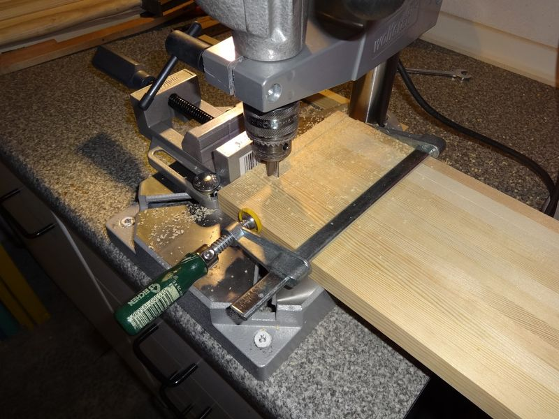

### Das erste Muster Tastenbeläge

Zunächst bestellte ich 4 Tastenbeläge bei Trinckle, und in diesem knalligen Rot kamen sie an:

*Tastenbeläge aus dem 3D-Drucker*

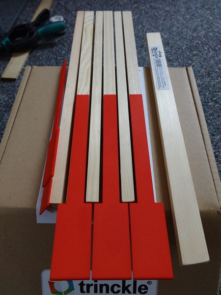

Nur die Vorderkanten sind bereits im 3D-Design abgerundet. Die Oberfläche ist rauh, und wie von Trinckle gewarnt worden war, dürfte sie nicht ganz abriebfest sein. Zur Haltbarmachung sollten sie noch infiltriert werden, z.B. mit Epoxydharz.

Mittlerweile hat sich herausgestellt, dass sie etwas zu lang sind, hinten ist der Platz zum Teil schon für die Klaviaturbäckchen reserviert. Diese müssen abgesägt werden, der Rest muss kürzer bestellt werden...

### Die Bestellung bei FTP

*Einzukaufende Spezialteile (ohne Klaviaturbäckchen)*

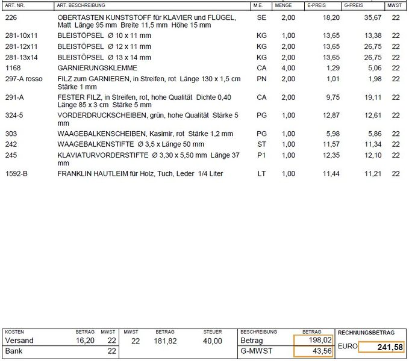

Dies sind bis auf die Klaviaturbäckchen alle Spezialbauklavierteile, die man braucht (und die fertig käuflich sind). Als Obertasten wählte ich matte, da ich mir von ihnen mehr Halt verspreche, und gerade bei einer 6+6-Tastatur ist guter Halt auf den Obertasten wichtig. Die Garnierungsklemmen helfen beim Garnieren der vorderen Führungslöcher der Tasten. Der feste Filz in Streifen ist für den hinteren Balken gedacht. Der Hautleim ist hoffentlich einer, der durch Dampf aufgeweicht werden kann. Garnierungen sind Verschleißteile und nach Jahren kann eine Erneuerung notwendig werden. Eine Klaviaturdruckzange wird hoffentlich nicht notwendig werden...

Die Teile wurden prompt wie bestellt geliefert. Vicenza (FTP) ist genauso nah wie Braunschweig (Meyne Klaviertechnik GmbH). Irgendwie scheint das Ende der Nationalstaaterei durchaus seine Vorteile zu haben. 

### Untertasten verbreitern

Zum Verbreitern der Untertasten (vorne) verwendete ich 20 x 5 mm Eichenholzleisten, die ich wieder an einer Seite abgeschrägt auseinandersägte. Je ein Plättchen sollte eine Seite der Taste verbreitern. Die eigentlich notwendige Dicke war nicht käuflich, so dass die 5 mm zusätzlich durch entsprechend zugeschnittene Pappscheiben vergrößert werden mussten.

Zunächst klebte ich mir eine Halterung zusammen, die das (oben und vorne) bündige Zusammenleimen von Tastenrohling, 4 Pappscheiben und 2 Eichenplättchen erleichtern würde.

*Tastenhalterung*

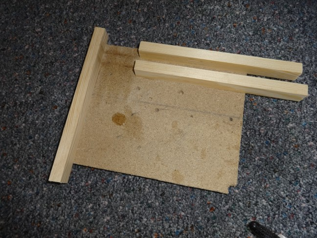

Damit gelang das exakte Zusammen der Untertasten spielend leicht. Im Vordergrund sieht man 2 der Eichenplättchen und Pappscheiben. Links oben sieht man eine trocknende, zusammengeleimte Untertaste.

*Zusammenleimen der Untertasten*

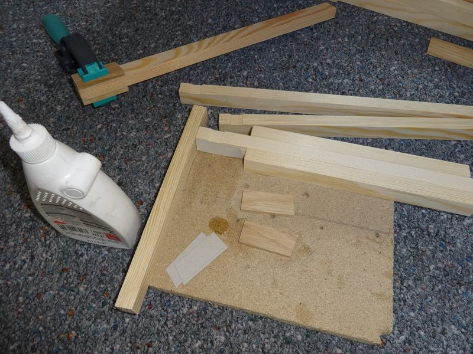

Was sich hinterher als ziemlich dumm herausstellte war, dass ich die Tasten zuerst gefräst und dann verbreitert hatte. Die Garnierungsklemmen konnten so nicht richtig angesetzt werden, da die 2 Verbreiterungen im Weg waren. Nach dieser Dummheit musste ich alle Untertasten noch einmal nachfräsen. Mit weniger hohen Verbreiterungen hätte ich das Problem vermeiden könnte. Das wäre möglich gewesen, da die Unterkanten später sowieso nicht zu sehen sein würden.

### Langlöcher

Mangels eines teuren Satzes Langlochfräser in allen möglichen Größen probierte ich es mit Holzbohrern. Man kann nicht voraussagen, was für eine Lochbreite man brauchen wird für einen 3,3 mm Klaviaturvorderstift + 2 x 1,0 mm durch eine Garnierungsklemme zusammengequetschten Filz + max. 0,2 mm Spiel dazwischen. Jedenfalls nicht 5,5 mm. Und schon gar nicht, was für eine Bohrerbreite, da durch Spiel im Maschinenschraubstock und Spiel des Bohrständers das Loch auf jeden Fall breiter als der Bohrer wird. Da geht Probieren über Studieren.

| Versuchsreihe |
| ----------- |
|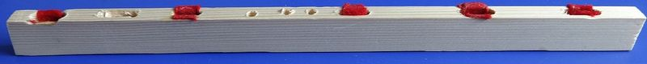|

Später entschied ich mich dazu, die Langlöcher ganz zu durchbohren, was eher unüblich ist. Ein Grund ist die geringe Höhe meiner Tasten von nur 20 mm, der gewichtigere Grund ist, dass man so von der anderen Seite kontrollieren kann, dass die Garnierungsklemme richtig sitzt und der Filz nicht zu weit in das Loch ragt.

Die besten Resultate kamen mit einem 4,0 mm Holzbohrer und dieser Technik zustande: 

- Bohrtiefe auf Tastenhöhe minus ein paar mm einstellen.
- 3 Löcher setzen.
- Die 2 Brücken zwischen den 3 Löchern mit dem Bohrer entfernen, dabei den Bohrer langsam nach unten bewegen und die Taste immer hin- und herbewegen.
- Bevor die Brücken ganz weg sein, Taste 180° um die vertikale Achse drehen und den Rest der Brücken mit der gleichen Technik entfernen.
- Taste um 180° drehen, diesmal vom Kopf auf den Fuß stellen. Ganz durchbohren und die Durchbohrung auf die ganze Länge erweitern.
- Taste 180° um die vertikale Achse drehen und nochmal hin- und herbewegen.

| 3 Löcher setzen | Brücken entfernen |
| ----------- | ----------- |
| 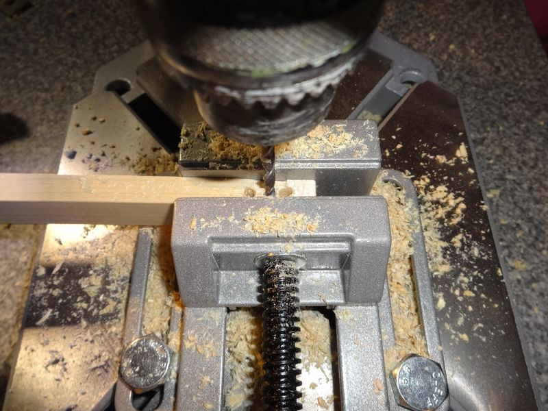 | 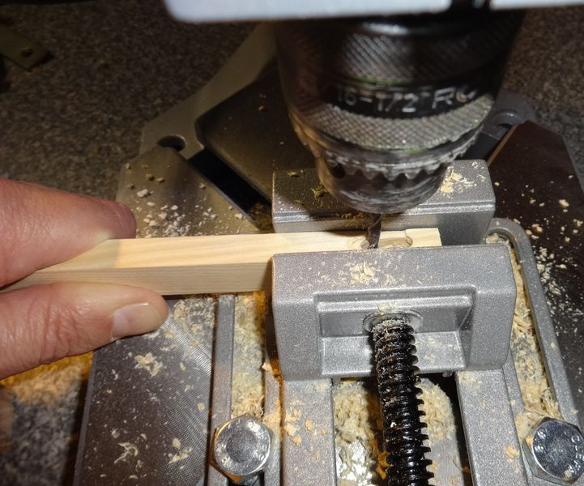 |

Am Ende entstanden dabei Langlöcher mit einer Breite um die 5 mm(!). Vielleicht könnte man also mit einem 5,0 mm Langlochfräser optimale Resultate erzielen, ohne umständlich in 4 Orientierungen bohren zu müssen. Vielleicht auch nicht.

### Garnieren

Als Leim nahm ich Titebond Professional Liquid Hide Wood Glue.

Nie hätte ich gedacht, dass man so viel falsch machen kann, wenn man Filz auf Holz kleben will:

- zu viel Leim: der Filz wird hart. Später streifte ich die Klebeseite auf einem Zeitungspapier ab, damit der Filz auf keinen Fall vom Leim ganz durchzogen wird.
- zu wenig Klebstoff hält nicht.
- Filz steht in der Taste über die Garnierungsklemme hinaus: ganz schlecht! Dann hat man am Ende einen breiten Pfropf und der Klaviaturstift stößt beim Eindringen auf Widerstand. Dieser Fall lässt sich nachträglich mit einem Bastelmesser beheben, indem man das Filzende an der gewünschten Stelle durchtrennt und hinterher mit einem Schraubenzieher das festgeklebte Zuviel wegschabt. Das kostet aber Zeit. Von Vorteil war es dabei, dass ich die Tasten ganz durchbohrt hatte. So konnten ich Filz- und Klebstoffreste leichter herausbefördern.
- Filz reicht nicht tief genug in die Taste. Auch schlecht, dann darf man's nochmal machen.

| Garnieren mit Klemme | Filzlängenkontrolle | Noch zu eng |
| ----------- | ----------- | ----------- |
| 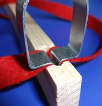 | 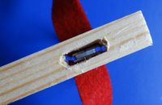 | 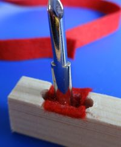 |

Übung macht den Meister, und spätestens nach der 20. Taste hat man den richtigen Dreh gefunden.

Die Streuung der Lochbreiten ist so groß, dass man bei manchen Tasten nicht ohne den Arbeitsschritt mit der Klaviaturdruckzange herumkommt. Wenn das Loch wenige 1/10 mm zu eng ist, so lässt es sich durch Zusammendrücken der Holzränder auf die gewünschte Breite bringen. Die sehr teure Klaviaturdruckzange hatte ich mir wie berichtet gespart. Ich behalf mit mit einer spitzen Flachzange, wobei ich die Außenseiten der Tasten durch ein zwischengelegtes Aluminiumblech vor dem Zangendruck schützte. Die Zange setzte ich so an, dass der Lastarm im Loch parallel zum Lochrand war. Der Lastarm außen hatte folglich einen spitzen Winkel zum Aluminiumblech. Das funktionierte überraschend problemlos.

Der Profi hat wahrscheinlich Garnierungsfilz in verschiedenen Stärken zur Auswahl. Vielleicht entscheidet er sich bei jedem Loch nach vorheriger Prüfung für die passende Stärke?

