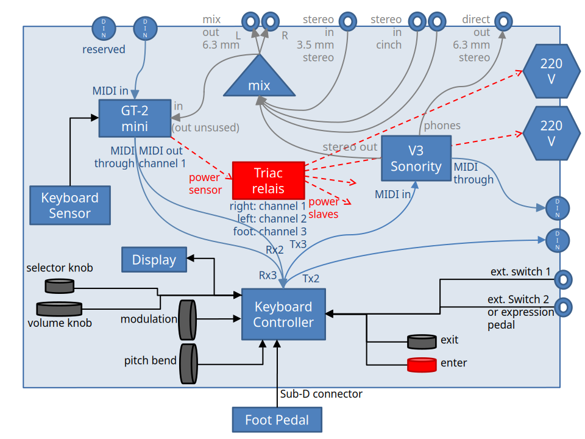
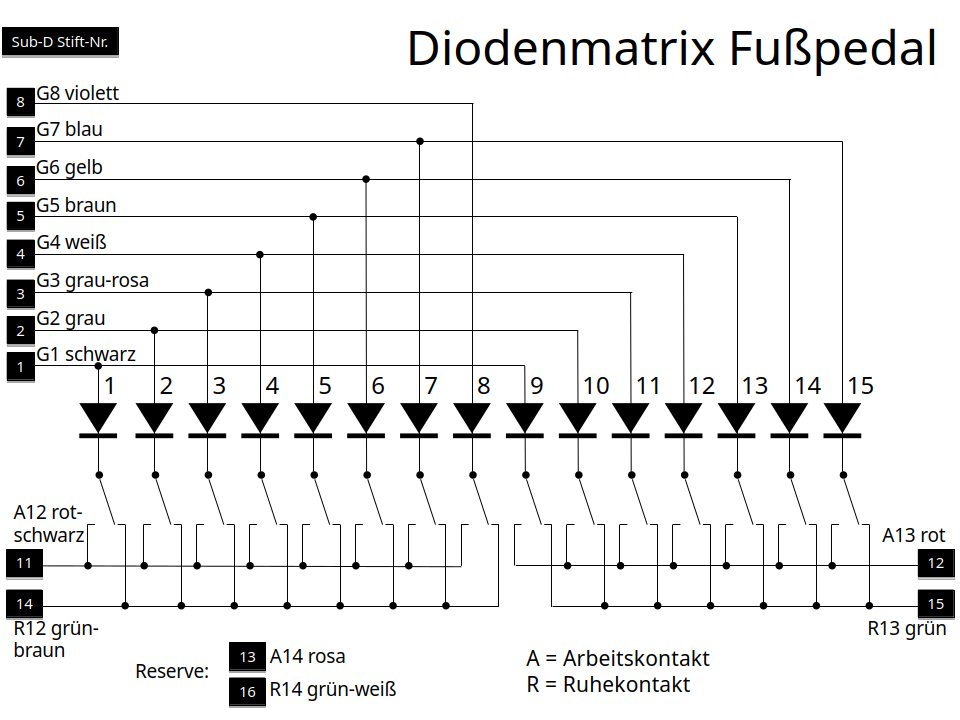
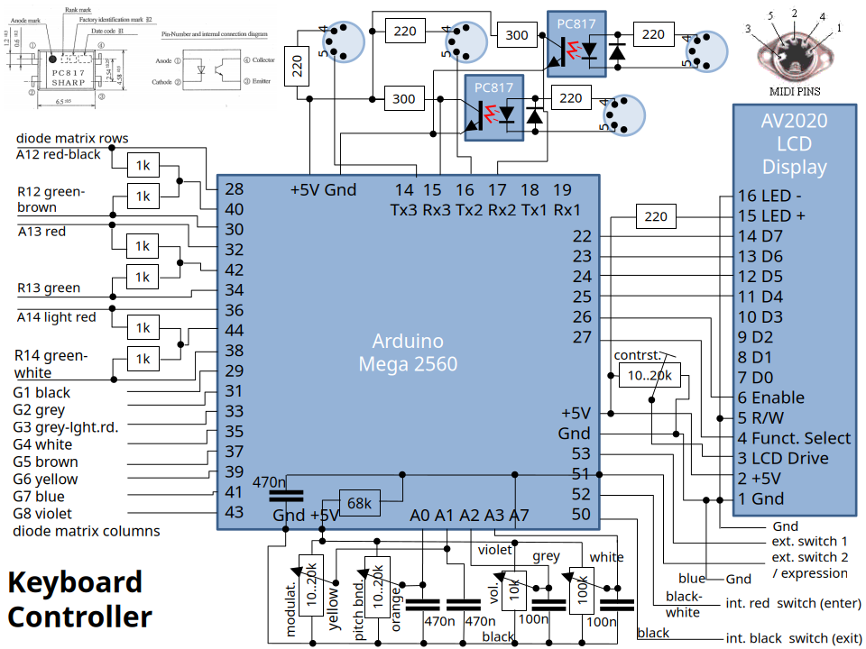
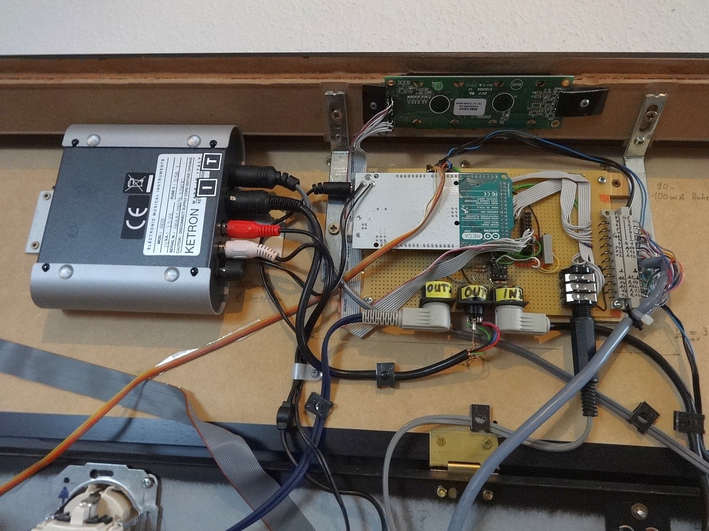
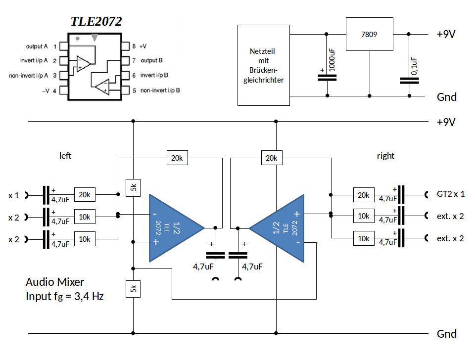
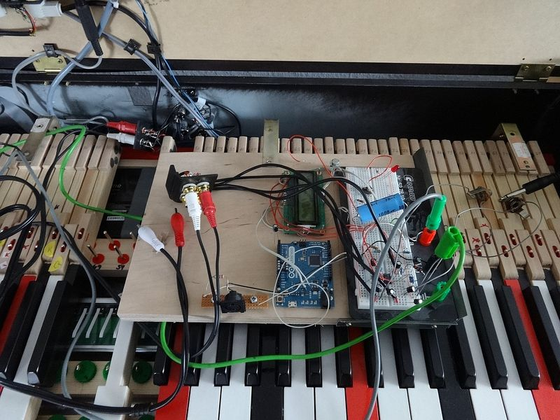
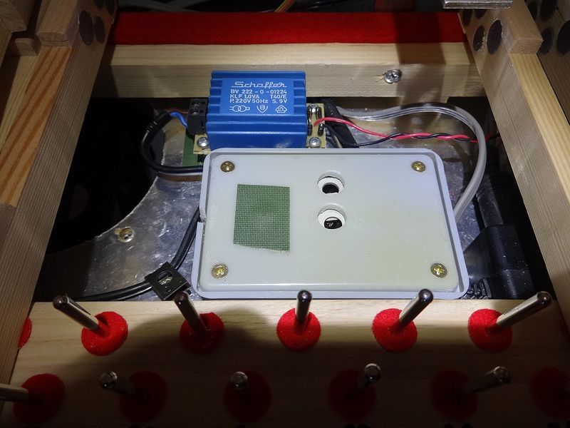
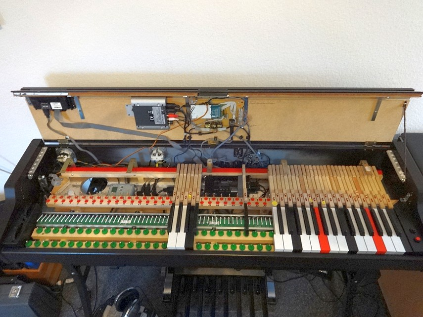
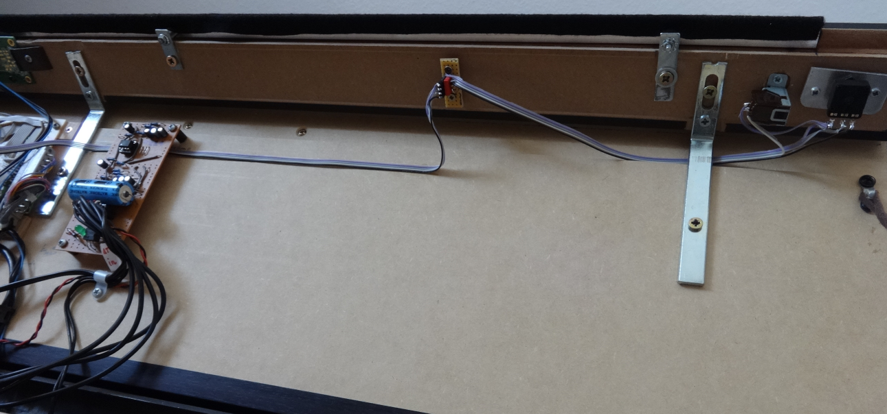

# Elektronik für die 6+6 Tastatur

## Module

Mit dem Hauptschalter des GT-2 mini schalten sich die komplette interne Elektronik sowie die beiden gesicherten Steckdosen auf der Rückseite mit ein und aus. Für diesen Komfort sorgt ein Triac-Relais mit Nulldurchgangsschaltung. Um es anzusteuern mussten 5V Versorgungsspannung aus dem Hauptmodul des GT-2 mini in gewährleistungsvernichtender Weise abgegriffen werden.

|Blockschaltbild|
| ----------- |
||

Das GT-2 mini Hauptmodul wird wie vorgesehen von der Tastatursensorleiste angesteuert und kann über seine Bedieneinheit bedient werden. Pedalsensoren sind keine angeschlossen, Sustain, Sostenuto usw. werden über die selbstgebaute Steuerung realisiert. Die Tastendrücke gelangen als MIDI-Nachrichten zur selbstgebauten Steuerung, die auf einem Arduino Mega 2560 basiert. An der Steuerung hängt ein 2x20 Zeilen LCD Display, MIDI-Ein- und Ausgänge, 2 Handräder für Pitch Bend und Modulation, 2 Taster, optional extern 2 Schalter und/oder ein Basspedal.

Die Steuerung mischt die diversen Sensorinformationen zu den MIDI-Daten, die vom GT-2 mini empfangen worden sind, und leitet das Gesamtkunstwerk über MIDI an das interne Ketron SD-2 GM Sound-Modul zwecks Hörbarmachung weiter.

Der MIDI-Eingang wird durch das GT-2 mini zur Steuerung geschleift. Diese mischt sie zum MIDI-Strom Richtung SD-2 hinzu. Dadurch kann das SD-2 als Sound Modul über den zweiten Eingang z.B. von einem Sequenzer genutzt werden, während gleichzeitig auf der Tastatur dazu gespielt wird.

Zur Bedienung der Steuerung dienen ein Regler mit benachbartem Schalter, 2 Taster (rot und schwarz), die 2 Handräder, die Tastatur (z.B. Festlegung einer Split-Position durch Tastendruck) und optional ein Fußpedal.

Der Audio-Ausgang des Ketron SD-2 sowie 2 externe Stereo-Eingänge (4 x Cinch) werden über den selbstgebauten Mischer geschleift zum externen Audio-Ausgang (2 x 6,3 mm Klinke).

Der Kopfhörer-Ausgang des Ketron SD-2 ist mit dem Audio-Eingang des GT-2 mini verbunden, so dass das SD-2 über Kopfhörer gehört werden kann. Das Metronom des GT-2 mini kann auf diese Art benutzt werden. Das GT-2 mini verfälscht das Eingangssignal stark. Viel Brillanz geht verloren. Während man sonst meint bei den E-Pianos des SD-2 hören zu können wie die Metallzungen angeschlagen werden, so ist dieser Eindruck futsch, sobald die Elektronik des GT-2 mini betreten wird. Aus diesem Grund und aufgrund der billigen Klänge des GT-2 mini wurde darauf verzichtet, sein Audio-Signal extra nach draußen zu legen. Es steht natürlich an seinen integrierten Kopfhörerbuchsen zur Verfügung.

## Arduino Mega 2560 mit Peripherie

Zunächst einmal gab es da ein schönes Wersi-Basspedal, das anschließbar sein sollte - selbstverständlich ein 6+6 Pedal. Es hing [früher](https://github.com/HaraldRieder/Historic/index.html) an einer eigens dafür aufgebohrten Döpfer LMK3-Elektronik und enthält eine zum LMK3 passende Diodenmatrix.

|Die anzuschließende Diodenmatrix|
| ----------- |
||

Deswegen finden sich im Schaltplan unten 6 Stück 1k Widerstände, die in LMK3-typischer Art geschaltet sind. Die Ansteuerung des Pedals gelang auf Anhieb. Ängste, dass Ladungen aus den Ausgängen eventuell nicht schnell genug übertragen werden könnten, bevor deren Wirkungen über die Eingänge der Matrix erfragt würden, erwiesen sich als unbegründet. Gegen solche Effekte hätte es aber ein Mittel gegeben: verzögertes Auslesen durch die Software.

Das Pedal wird mit einem Sub-D Stecker an das Pianogehäuse angeschlossen.

|Digitalteil mit Arduino Mega 2560|
| ----------- |
||

Über den Anschluß von MIDI-Peripherie und LCD-Anzeigen an Arduino-Boards gibt es haufenweise Anleitungen. Diese brauchen hier nicht wiederholt zu werden. Der Mega 2560 könnte bis zu 4 MIDI-Ein- und Ausgänge bedienen. Ich habe die Schaltung auf 2 MIDI-Ein und Ausgänge ausgelegt, derzeit ist nur 1 Eingang bestückt.

_Der Digitalteil wurde ab Herbst 2015 nach und nach in Betrieb genommen. Im Frühjahr 2016 zeigten sich nach längerem Betrieb erstmals lustige Effekte: Aussetzer, falsche Tonhöhen, ganz andere Klangfarben als die eingestellte. So hören sich typischerweise MIDI-Bitfehler an, und da es in kaltem Zustand nach dem Einschalten nie Fehler gab, war klar, dass es ein Temperatureffekt sein musste. Der 220 Ohm Widerstand am MIDI-Eingang war etwas zu groß bemessen für den verwendeten PC 817 Optokoppler. Die Reparatur erfolgte durch Austausch des PC 817 gegen ein anderes Exemplar. Alternativ hätte man den Widerstand verkleinern können._

Die Handräder werden zwar von relativ niederohmigen Potentiometern abgegriffen, sind allerdings über lange Leitungen mit der Steuerung verbunden. Die 470 nF Glättungskondensatoren sind deswegen tatsächlich erforderlich! Ohne sie bekäme die Software von der Hardware nerviges Gezappel zu hören.

Für die internen Taster und externen Schalter werden die im Arduino integrierten Pullup-Widerstände ausgenutzt. Damit gab es noch nie ein falsches Signal.

2019 wurden noch ein Potentiometer und ein Schalter auf der rechten Seite der Frontblende hinzugefügt. Beide sind an analoge Eingänge angeschlossen, der Schalter mit einem 22k Pulldown Widerstand. Damit sind immer noch 4 analoge Eingänge unbeschaltet.

Das nächste Bild zeigt den Teil der Elektronik, der am aufklappbaren Deckel des Pianogehäuses hängt:

- links Ketron SD-2 Sound-Modul
- rechts Steuerung mit Arduino Board. Der Klinkenstecker kommt von den beiden Mono-Klinkenbuchsen für die externen Schalter. Der graue Stecker rechts führt zur Pedalanschlussbuchse (Sub-D).
- oben 2x20 zeilige LCD-Anzeige
- rechts neben dem Arduino pressspänerne Leere: später hat sich an diese Stelle der Audio-Mischer hinzugesellt.

|Elektronik im Deckel|
| ----------- |
||

Viel mehr ist zum Digitalteil nicht zu sagen, den Rest muss die Software erledigen.

## Audio-Mischer

Der Audiomischer hat zunächst ein eigenes Analognetzteil mit Transformator und Brückengleichrichter bekommen, um nicht auf unerwünschte Weise mit dem Digitalgedöns verbunden sein zu können (Brummschleife!). Ein 7809 Spannungsregler regelt auf 9V, was für viele Operationsverstärker ausreicht.

Es kommt ein Operationsverstärker TLE2072 zum Einsatz, der rauschärmer als ein TL072 sein soll. Ich meine, dass der größere Teil des noch hörbaren Rauschens vom GT-2 mini beigesteuert wird.

|Schaltplan Audio-Mischer|
| ----------- |
||

Der Mischer "verstärkt" den für das Ketron SD-2 vorgesehenen Stereo-Kanal mit dem Faktor 1. Der Lautstärkeschieberegler des Ketron ist immer voll aufgedreht. Die beiden externen Stereo-Kanäle werden mit einem Faktor 2 verstärkt. Das soll es erlauben, das interne Sound-Modul bei Bedarf zu übertönen. Der Stereo-Ausgang ist auf den Eingang des GT-2 mini gelegt. Dort darf man das Eingangssignal nicht ganz aufdrehen, weil es sonst schon allein mit dem Ketron zu Übersteuerungen kommt.

|Der Mischer entsteht|
| ----------- |
||

Der Mischer wurde zunächst auf einem Experimentierbrett aufgebaut. Dabei gab es keine Überraschungen, außer dass ich in einem Anfall von geistiger Umnachtung zuerst den Spannungsregler nicht eingeplant hatte und mit entsprechendem Gebrumme bestraft wurde.

|Master-Slave-Switch und Mischer-Netzteil|
| ----------- |
||

Das Bild zeigt das graue Gehäuse des Master-Slave-Netzschalters und das daran angeschlossene Netzteil für den Mischer mit seinem blauen Transformator und 4 1N4006 Dioden in Brückenschaltung.

## Alles zusammen

|Elektronik untergebracht, noch ohne Mischer|
| ----------- |
||

|Mischer und neue Bedienelemente an der Frontblende|
| ----------- |
||

