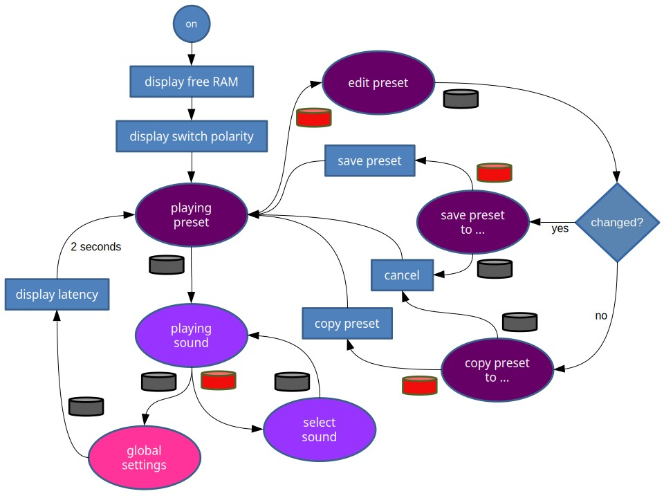

# Weichware

Der Quellecode für das Arduino Mega 2560 Board ist [auf GitHub](https://github.com/HaraldRieder/Keyboard_Controller) verfügbar.

Das Board verfügt über 8 KByte Hauptspeicher (RAM) und 4 KByte EEPROM,
in dem die duch den Bediener vorgenommenen Einstellungen dauerhaft gespeichert werden.

Aktuell wird davon ausgegangen, dass ein V3 Sonority XXL angesteuert werden soll (`SonorityXXL.h`).
Davor war die Software zur Steuerung eines Ketron SD2 ausgelegt (`KetronSD2.h`).

Der Quellcode lässt sich mit vertretbarem Aufwand an andere MIDI Module anpassen.
Nicht jedes Modell bietet dieselben Funktionen an,
doch die Unterstützung vieler Standard-MIDI-Funktionen ist heutzutage weit verbreitet.
Unterschiede finden sich naturgemäß im Sysex-Bereich.

## Initialisierung

Aktuell werden 35 Presets unterstützt.
Wird ein Preset gelesen und dabei nicht der "magische" 32-Bit-Wert `2e031fe5` gefunden, dann wird es mit Standardeinstellungen initialisiert:
das Pedal arbeitet als Steuerpedal (Controller) und der Tastaturbereich ist nicht geteilt (Split).
Auf diese Weise kann ein neues Board in Betrieb genommen werden.

## Latenzen

Nach dem Verlassen der globalen Einstellungen (siehe Bedienung) werden kurz Zeiten eingeblendet, die zur Latenz beitragen:

- Loop delay: die Zeit, die das Arduino Board für seine eigenen Geschäfte benötigt, bevor es wieder die Kontrolle an den Anwendungscode abgibt
- Pedal scan: die Zeit, die für das einmalige Ermitteln der Stellung der 15 Pedaltasten benötigt wird

Die Zeiten werden zyklisch gemessen. Angezeigt werden die jeweils gemessenen Maximalwerte. In Summe bewegen sie sich um oder unter 1 ms.

Zum Vergleich: bei 31250 baud (Bit/s) kann man über eine klassische MIDI-Verbindung in 1 ms wieviel Note-on oder Note-off Nachrichten übertragen?
Jede solche Nachricht benötigt 3 Byte. Jedes Nutz-Byte wird dank Start- und Stopbit auf 10 Bit vergrößert, wodurch jede solche Nachricht 30 Bit lang wird.
Also kann man in einer Millisekunde 0,001 x 31250 / 30 = eine einzige MIDI-Nachricht übertragen.

Bei kontinuierlichen Reglern kann es aufgrund von Rauschen (mechanisch, thermisch) zu häufigen Änderungen der digitalisierten Werte kommen,
die das Potential dazu haben, einen MIDI-Kanal zu verstopfen. Die Software verfügt über Mechanismen zur Rauschunterdrückung.

## Bedienung

### Bedienelemente

- schwarzer Taster: Durchwechseln, Ausgang, Abbruch
- roter Taster: Eintritt, Bestätigen
- schwarzer Schalter: legt die Funktion des Reglers fest, d.h. Lautstärke oder Parameter einstellen.
- Regler: bei gedrücktem Schalter werden Parameterwerte eingestellt, sonst dient er als Regler der Gesamtlautstärke.
- Tonhöhenrad: zur Beeinflussung der Tonhöhe ("pitch bend") oder je nach Preset auch anderer MIDI-Controller. Wenn ein Preset editiert wird, dann werden mit diesem Rad Parameterwerte eingestellt.
- Modulationsrad: steuert den Vibratoeffekt ("modulation") oder je nach Preset auch andere MIDI-Controller. Wenn ein Preset editiert wird, dann werden mit diesem Rad einzustellende Parameter ausgesucht.
- Pedal: ein 15-Tastenpedal kann wahlweise als Basspedal oder zur Steuerung von MIDI-Controllern verwendet werden.
- externer Schalter: standardmäßig für ein Haltepedal vorgesehen, kann je nach Preset auch andere MIDI-Controller beeinflussen.
- externer Regler: steuert den Ausdruck ("expression") auf der Tastatur, je nach Einstellung nur auf dem linken, rechten oder gesamten Bereich. Viele MIDI-Module interpretieren diesen Controller standardmäßig als Kanallautstärke. Oft lässt sich etwas anderes zuordnen.

### Einschalten

Beim Einschalten wird für wenige Sekunden der noch freie Speicher (RAM) angezeigt.

Außerdem wird automatisch ermittelt, ob der externe Schalter als Öffner oder Schließer arbeitet.
Damit dies gelingen kann, sollte der Schalter beim Einschalten in seiner Ruheposition sein.
Das Ergebnis wird ebenfalls für wenige Sekunden angezeigt.

Nach dem Einschalten wird das erste Preset geladen und angezeigt.

### Spielmodus und globale Einstellungen

Mit dem schwarzen Taster kann zyklisch gewechselt werden zwischen

- Spielen von Presets
- Spielen von Sounds
- Globale Einstellungen

Wenn der schwarze Schalter gedrückt ist, dann wechseln Bedienelemente ihr Verhalten je nach Modus.
 

| Bedienelement | Spielen von Presets | Spielen von Sounds | Globale Einstellungen |
| --------| -----| -----| -----|
| **Regler** | Preset-Auswahl | Sound-Auswahl | Parameterwert |
| **Modulationsrad** |  | Sound-Bank | Parameter-Auswahl (derzeit nur Dynamikkurve) |

Aus dem Modues *Spielen von Presets* gelangt man in den Editier-Modus durch Drücken des roten Tasters, den man mit dem schwarzen Taster wieder verlassen kann.

Wurde das Preset verändert, so wird man gefragt, ob man das Preset speichern möchte. Standardmäßig wird es an die aktuelle Position gespeichert. Mit dem Modulationsrad lässt sich jedoch eine anderes Ziel wählen, das heißt, dass das editierte Preset nicht geändert wird sondern ein anderes Preset überschrieben wird. Der rote Taster bestätigt das Speichern. Mit dem schwarzen Taster lassen sich die Änderungen verwerfen.

Wurde das Preset nicht verändert, so wird man gefragt, ob man das Preset kopieren möchte. Mit dem Modulationsrad lässt sich das Ziel für die Kopieraktion wählen. Der rote Taster bestätigt das Kopieren. Mit dem schwarzen Taster lassen sich die Änderungen verwerfen.

### Editieren eines Preset

Ein Preset besteht aus vielen Parametern, die in Gruppen zusammengefasst sind. Die Gruppe lässt sich mit dem Modulationsrad auswählen. Es gibt diese Gruppen:

- Gemeinsame Parameter
- Tastatur-Parameter (wenn Tastatur nicht geteilt)
- Pedal-Parameter (nur im Pedalmodus *Bass*)
- Parameter für linken Tastaturabschnitt (nur wenn Tastatur geteilt)
- Parameter für rechten Tastaturabschnitt (nur wenn Tastatur geteilt)
- Parameter für rechten Tastaturabschnitt (zweite Klangschicht, nur wenn Tastatur geteilt)

Die Parameter in den Gruppen werden mit dem Modulationsrad ausgewählt. Parameterwerte können mit dem Tonhöhenrad oder dem Regler eingestellt werden.

#### Gemeinsame Parameter

- Tastaturtrennung links/rechts (Split-Position). Die Position lässt sich auch durch Drücken einer Taste der Tastatur einstellen. Zum Aufheben der Trennung muss das Modulationsrad oder der Regler bemüht werden.
- Pedal-Modus: Wahl zwischen Bass- oder Fußschalter-Modus
- Typ des 1. Effektgeräts (FX1)
- Typ des 2. Effektgeräts (FX2)

#### Tastatur-Parameter, Pedal-Parameter, Parameter für Tastaturabschnitte

Diese Gruppen enthalten immer denselben Satz an Parametern:

- Sound Bank
- Sound (MIDI-Programm-Nummer)
- Transponierung in "Halbton"-Schritten
- Feinstimmung in Cent-Schritten
- Relative Lautstärke
- Stereo-Panorama
- Hall (1. Effektgerät)
- Effekt (2. Effektgerät)
- Tiefpass-Frequenz (Cutoff)
- Filter-Resonanz
- Ankling-Geschwindigkeit (Attack)
- Abkling-Geschwindigkeit vor dem Loslassen der Taste (Decay)
- Abkling-Geschwindigkeit nach dem Loslassen der Taste (Release)
- Vibrato-Frequenz (Rate)
- Vibrato-Stärke (Depth)
- Vibrato-Verzögerung (Delay)
- Weitere Parameter zum Zuordnen von Bedienelementen zu MIDI-Controllern.

### Pedal

Das Pedal dient entweder zum Bassspiel, wenn es in den Preset-Einstellungen so definiert ist, oder zur Steuerung der Funktionen, die auf dem Bild gezeigt sind. Soft, Sustain (Haltepedal) und Sostenuto sind von Klavieren her bekannt. Wenn im Preset-Modus ein Tastatursplit aktiv ist, dann können Sustain und Sostenuto für linken und rechten Klaviaturbereich getrennt gesteuert werden. Unterstützung von Wha-Wha, Portamento und Rotorgeschwindigkeit hängen vom gewählten Sound des angesteuerten MIDI-Moduls ab.

Mit den linken 4 kurzen Pedalen lassen sich Presets oder Sounds in 10er- oder 1er-Schritten weiterschalten. Eine weitere Funktion ist das Wechseln der Bank im Sound-Modus.

#### Scale Tune

Mit Hilfe dieses Pedals lassen sich verschiedene Feinstimmungen wählen.
Wird das Pedal gedrückt, dann wird die gewählte Feinstimmung angezeigt.
Mit gleichzeitigem Betätigen einer Taste wird eine neue Feinstimmung gewählt.
Die Feinstimmung wird immer global verwendet, d.h. für das Basspedal und alle Tastatur-Bereiche.

In der europäischen Musik ist es üblich, aufeinanderfolgende Tasten im Frequenzverhältnis 2 hoch (1/12) zu stimmen. Dies ist die Normaleinstellung aller handelsüblichen MIDI-Module und -Synthesizer.
Durch diese Wahl wird nach 12 Tasten ein Naturtonintervall erreicht: die "Oktave" mit einem Frequenzverhältnis von 2. Andere Naturtonintervalle können nur näherungsweise erreicht werden: die "kleine Terz" (6/5), die "große Terz" (5/4), die "Quarte" (4/3), die "Quinte" (3/2), usw. Während die Quinten und Quarten gut angenähert werden, gibt es bei den Terzen eine deutlich hörbare Schwebung.

Eine andere Näherungsstimmung, die mitteltönige (meantone) Stimmung, teilt die "Oktave" statt in 12 in 31 gleiche Frequenzverhältnisse. Aufeinanderfolgende Tasten sind in einem Vielfachen von 2 hoch (1/31) gestimmt. Mangels Tasten konventioneller Tastaturen lassen sich nur 12 der 31 Töne (je "Oktave") zum Klingen bringen. Die Wahl des Grundtons bestimmt, welche 12 dieser 31 Töne zu hören sind. Der Vorteil dieser Stimmung ist die bessere Näherung an die Naturton-Terzen, während Quarten und Quinten etwas schlechter erreicht werden.

Die Naturtonstimmung (clean) verwendet reine "Oktaven", "Quinten" und "große Terzen" zum Aufbau aller Intervalle ausgehend vom Grundton, d.h. die Frequenzverhältnisse 2, 3/2 und 5/4. Reine Quarten und kleine Terzen werden automatisch erreicht, da z.B. 4/3 = 2 / (3/2).

Die Naturtonstimmung gibt es in einer symmetrischen Variante, bei der der Tritonus "normal" gestimmt bleibt.

Weiter zur Auswahl stehen eine exotischere Naturtonstimmung aufgebaut aus 7/6 ("Septimen") statt 5/4 ("Terzen") und eine aus dem arabischen Kulturraum stammende Stimmung.

