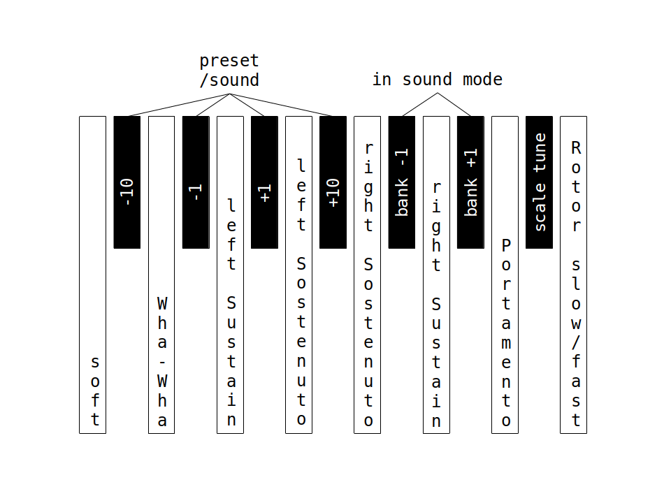

# Weichware

Der Quellecode ist [auf GitHub](https://github.com/HaraldRieder/Keyboard_Controller) verfügbar.

## Pedal

Das Pedal dient entweder zum Bassspiel, wenn es im Preset-Modus so definiert ist, oder zur Steuerung der Funktionen, die auf dem Bild gezeigt sind. Soft, Sustain (Haltepedal) und Sostenuto sind von Klavieren her bekannt. Wenn im Preset-Modus ein Tastatursplit aktiv ist, dann können Sustain und Sostenuto für linken und rechten Klaviaturbereich getrennt gesteuert werden. Unterstützung von Wha-Wha, Portamento und Rotorgeschwindigkeit hängen vom gewählten Sound des Ketron SD 2 ab.

|Funktionen Pedal|
| ----------- |
||

Mit den linken 4 kurzen Pedalen lassen sich Presets oder Sounds in 10er- oder 1er-Schritten weiterschalten. Eine weitere Funktion ist das zyklische Weiterschalten der Bank im Sound-Modus. Scale Tune ist noch nicht implementiert.

