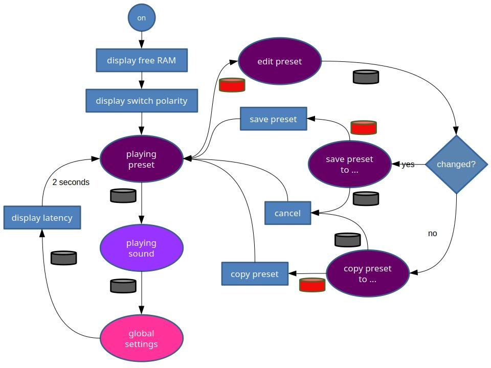
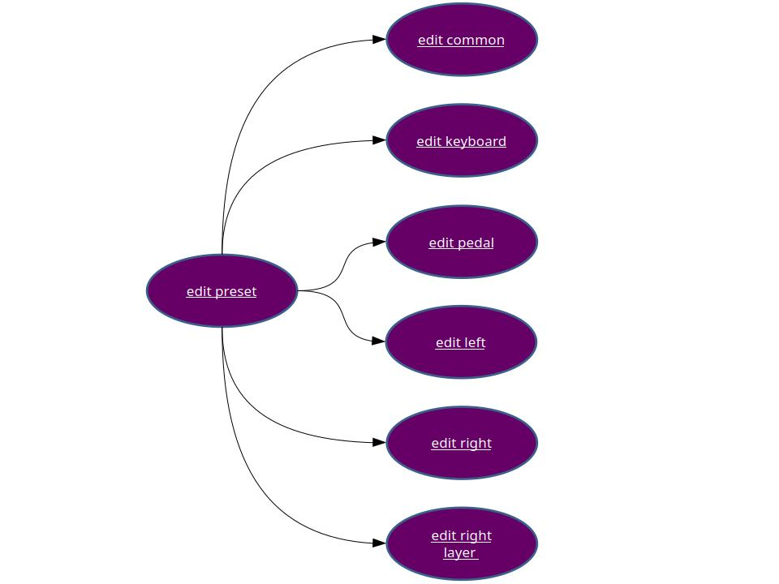

# Weichware

Der Quellecode für das Arduino Mega 2560 Board ist [auf GitHub](https://github.com/HaraldRieder/Keyboard_Controller) verfügbar.

Das Board verfügt über 8 KByte Hauptspeicher (RAM) und 4 KBytes EEPROM,
in dem die duch den Bediener vorgenommenen Einstellungen dauerhaft gespeichert werden.

Aktuell wird davon ausgegangen, dass ein V3 Sonority XXL angesteuert werden soll (`SonorityXXL.h`).
Davor war die Software zur Steuerung eines Ketron SD2 ausgelegt (`KetronSD2.h`).

Der Quellcode lässt sich mit vertretbarem Aufwand an andere MIDI Module anpassen.
Nicht jedes Modell bietet dieselben Funktionen an,
doch die Unterstützung vieler Standard-MIDI-Funktionen ist heutzutage weit verbreitet.
Unterschiede finden sich naturgemäß im Sysex-Bereich.

## Initialisierung

Aktuell werden 35 Presets unterstützt.
Wird ein Preset gelesen und dabei nicht der "magische" 32-Bit-Wert `2e031fe5` gefunden, dann wird es mit Standardeinstellungen initialisiert:
das Pedal arbeitet als Steuerpedal (Controller) und der Tastaturbereich ist nicht geteilt (Split).
Auf diese Weise kann ein neues Board in Betrieb genommen werden.

## Latenzen

Nach dem Verlassen der globalen Einstellungen (siehe Bedienung) werden kurz Zeiten eingeblendet, die zur Latenz beitragen:

- Loop delay: die Zeit, die das Arduino Board für seine eigenen Geschäfte benötigt, bevor es wieder die Kontrolle an den Anwendungscode abgibt
- Pedal scan: die Zeit, die für das einmalige Ermitteln der Stellung der 15 Pedaltasten benötigt wird

Die Zeiten werden zyklisch gemessen. Angezeigt werden die jeweils gemessenen Maximalwerte. In Summe bewegen sie sich um oder unter 1 ms.

Zum Vergleich: bei 31250 baud (Bit/s) kann man über eine klassische MIDI-Verbindung in 1 ms wieviel Note-on oder Note-off Nachrichten übertragen?
Jede solche Nachricht benötigt 3 Byte. Jedes Nutz-Byte wird dank Start- und Stopbit auf 10 Bit vergrößert, wodurch jede solche Nachricht 30 Bit lang wird.
Also kann man in einer Millisekunde 0,001 x 31250 / 30 = eine einzige MIDI-Nachricht übertragen.

Bei kontinuierlichen Reglern kann es aufgrund von Rauschen (mechanisch, thermisch) zu häufigen Änderungen der digitalisierten Werte kommen,
die das Potential dazu haben, einen MIDI-Kanal zu verstopfen. Die Software verfügt über Mechanismen zur Rauschunterdrückung.

## Bedienung

### Bedienelemente

- schwarzer Taster: Durchwechseln, Ausgang, Abbruch
- roter Taster: Eintritt, Bestätigen
- schwarzer Schalter: legt die Funktion des Reglers fest, d.h. Lautstärke oder Parameter einstellen.
- Regler: bei gedrücktem Schalter werden Parameterwerte eingestellt, sonst dient er als Regler der Gesamtlautstärke.
- Tonhöhenrad: zur Beeinflussung der Tonhöhe ("pitch bend") oder je nach Preset auch anderer MIDI-Controller. Wenn ein Preset editiert wird, dann werden mit diesem Rad Parameterwerte eingestellt.
- Modulationsrad: steuert den Vibratoeffekt ("modulation") oder je nach Preset auch andere MIDI-Controller. Wenn ein Preset editiert wird, dann werden mit diesem Rad einzustellende Parameter ausgesucht.
- Pedal: ein 15-Tastenpedal kann wahlweise als Basspedal oder zur Steuerung von MIDI-Controllern verwendet werden.
- externer Schalter: standardmäßig für ein Haltepedal vorgesehen, kann je nach Preset auch andere MIDI-Controller beeinflussen.
- externer Regler: steuert den Ausdruck ("expression") auf der Tastatur, je nach Einstellung nur auf dem linken, rechten oder gesamten Bereich. Viele MIDI-Module interpretieren diesen Controller standardmäßig als Kanallautstärke. Oft lässt sich etwas anderes zuordnen.

### Einschalten

Beim Einschalten wird für wenige Sekunden der noch freie Speicher (RAM) angezeigt.

Außerdem wird automatisch ermittelt, ob der externe Schalter als Öffner oder Schließer arbeitet.
Damit dies gelingen kann, sollte der Schalter beim Einschalten in seiner Ruheposition sein.
Das Ergebnis wird ebenfalls für wenige Sekunden angezeigt.

Nach dem Einschalten wird das erste Preset geladen und angezeigt.

### Spielmodus und globale Einstellungen

Mit dem schwarzen Taster kann zyklisch gewechselt werden zwischen

- Spielen von Presets
- Spielen von Sounds
- Globale Einstellungen

Mit dem roten...

### Editieren eines Preset

### Pedal

Das Pedal dient entweder zum Bassspiel, wenn es im Preset-Modus so definiert ist, oder zur Steuerung der Funktionen, die auf dem Bild gezeigt sind. Soft, Sustain (Haltepedal) und Sostenuto sind von Klavieren her bekannt. Wenn im Preset-Modus ein Tastatursplit aktiv ist, dann können Sustain und Sostenuto für linken und rechten Klaviaturbereich getrennt gesteuert werden. Unterstützung von Wha-Wha, Portamento und Rotorgeschwindigkeit hängen vom gewählten Sound des Ketron SD 2 ab.

|Funktionen Pedal|
| ----------- |
||

Mit den linken 4 kurzen Pedalen lassen sich Presets oder Sounds in 10er- oder 1er-Schritten weiterschalten. Eine weitere Funktion ist das zyklische Weiterschalten der Bank im Sound-Modus. Scale Tune ist noch nicht implementiert.

